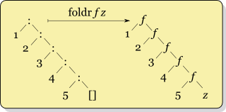

# 🔷 <b>요약</b>
- binary 오퍼레이터을 통해 파리미터 팩(Parameter Pack) 줄여서 표현하는 표현식
- binary 혹은 unary fold 두 종류가 존재.
<br>
# 🔷 <b>탄생 배경</b>
 C++ 11에 도입된 가변 길이 템플릿(variadic template)을 재귀 함수 형태로 구성시, 반드시 재귀 호출 종료를 위한 함수(terminator)를 만들어야하는 불편함이 있었다.
 
 <br>

```cpp
template<typename Type1, typename... Type>
int SumAll(Type1 s, Type... ts>
{
	return s + SumAll(ts...);
}

// 파라미터 팩이 없을 경우의 바운더리 컨디션
int SumAll() { return 0; }
```
<br>
기존 방식으로는 이 두 함수의 연관성을 알아보기 어렵다는 문제가 있었다.

이를 해결하기 위해, C++ 17에 Fold Expression이 도입 되었고, 위의 예제를 아래와 같이 쉽게 표현할 수 있게 되었다.
<br>
```cpp
template <typename... Ints>
int SumAll(Ints... nums)
{
    return (... + nums);
}
```
<br>

# 🔷 <b>Fold</b>
Fold는 함수형 프로그래밍에 존재하는 개념으로, 고차 함수 계열 중 하나이다.<br>
함수의 인자에 대하여 특정 연산자에 대해 재귀적으로 처리한 결과 값을 반환한다.



Fold의 종류는 Unary, Binary 두 종류로 나뉘며, 이 또한 right/left로 나누어지는데,<br>
Right/Left 기준은 pack(...)의 위치이며, pack의 위치에 따라 오퍼레이터의 순서가 결정됨.
<br>

## <b>Unary Fold</b>
1. Unary Right Fold (pack op ...)
    ```cpp
    template<typename... Args>
    auto Sum(Args... args)
    {
        return (args + ...);
    }

    auto value = Sum(3, 5, 7, 9); // value == 24
    ```

    unpack시 operator가 우측부터 적용 시킨다.<br><br> 
    e.g. (3 + (5 + (7 + 9)))
<br>

2. Unary Left Fold (... op pack)
   ```cpp
    template<typename... Args>
    auto Sum(Args... args)
    {
		return (... + args);
    }

    auto val = Sum(3, 5, 7, 9); // value == 24
   ```
   unpack시 operator를 좌측부터 적용 시킴. <br><br>
   e.g. (((3 + 5) + 7) + 9)
<br>

## <b>Binary Folds</b>
- binary fold expression은 init 값을 가진다.
- 이 값은 parameter pack에는 포함되지 않는 값이며, Left/Right 여부 관계없이 가장 먼저 operator의 대상이 된다.
- Binary Fold Expression을 사용시 op가 확실하게 다른 op의 우선순위와 구분 되게끔 해야한다.

<br>

1. <b>Binary Right Fold `(pack op .. op init)` </b>

    ```cpp
    template<typename... Args>
    auto Sum(Args... args)
    {
    		// 1 -> init
    		return (args + ... + 1);
    }
    ```

    순서: (3 + (5 + (7 + (9 + 1))))

2. Binary Left Fold `(init op ... op pack)`

    ```cpp
    template<typename... Args>
    auto Sum(Args... args)
    {
    		// 1 -> init
    		return (1 + ... args);;
    }
    ```
<br>

- Fold Expression에 사용 가능한 Binary Operator로는 32가지가 있다.

- 전체 목록은 [**여기**](https://en.cppreference.com/w/cpp/language/fold)를 참조

<br>

# 🔷 <b>Fold Expression를 활용해 함수 여러번 호출하기</b>
```cpp
#include <iostream>

class A 
{
public:
    void DoSomething(int x) const 
    {
        std::cout << "Do something with " << x << std::endl;
    }
};

template <typename T, typename... Ints>
void DoManyThings(const T& kT, Ints... nums) 
{
  // 각각의 인자들에 대해 do_something 함수들을 호출한다.
    (t.DoSomething(nums), ...);
}

int main() 
{
    A a;
    DoManyThings(a, 1, 3, 2, 4);
}
```
위 코드를 컴파일하면... 
```cpp
Do something with 1
Do something with 3
Do something with 2
Do something with 4
```
이와 같은 결과가 나온다.

```cpp
(t.DoSomething(nums), ...);
```
위는 사실상 모든 인자들에 대해서 ```t.DoSomething(arg)```를 실행하는 것과 같다.

<br>

# 📚 레퍼런스
[https://www.modernescpp.com/index.php/fold-expressions](https://www.modernescpp.com/index.php/fold-expressions)

[https://baptiste-wicht.com/posts/2015/05/cpp17-fold-expressions.html](https://baptiste-wicht.com/posts/2015/05/cpp17-fold-expressions.html)

[http://filipjaniszewski.com/2016/11/24/c17-folding-expression/](http://filipjaniszewski.com/2016/11/24/c17-folding-expression/)

[https://blog.tartanllama.xyz/exploding-tuples-fold-expressions/](https://blog.tartanllama.xyz/exploding-tuples-fold-expressions/)

[https://modoocode.com/290](https://modoocode.com/290)